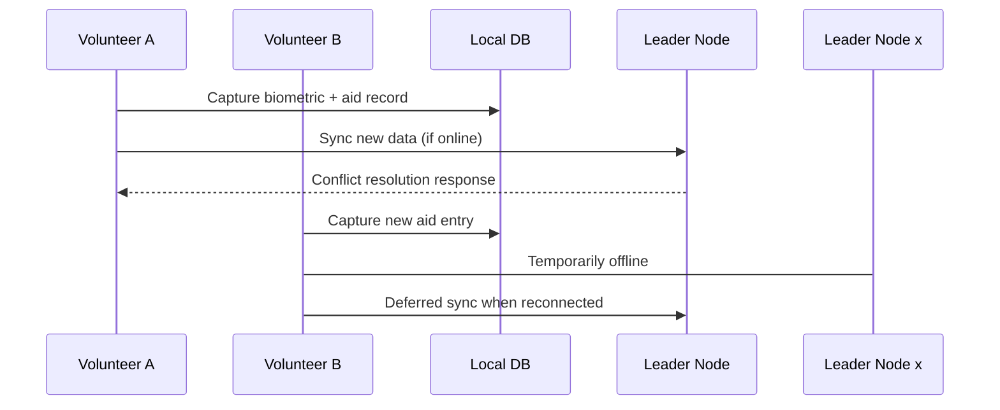
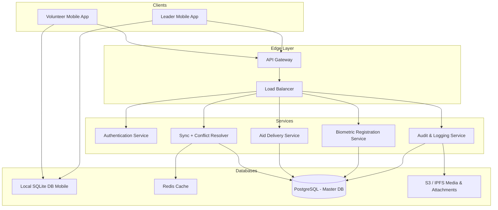
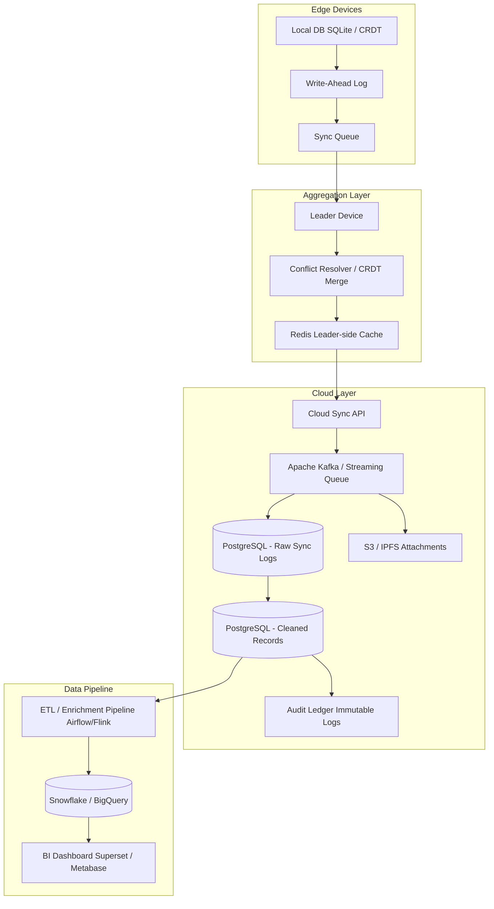
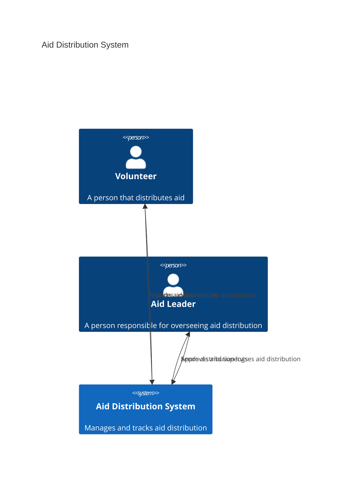
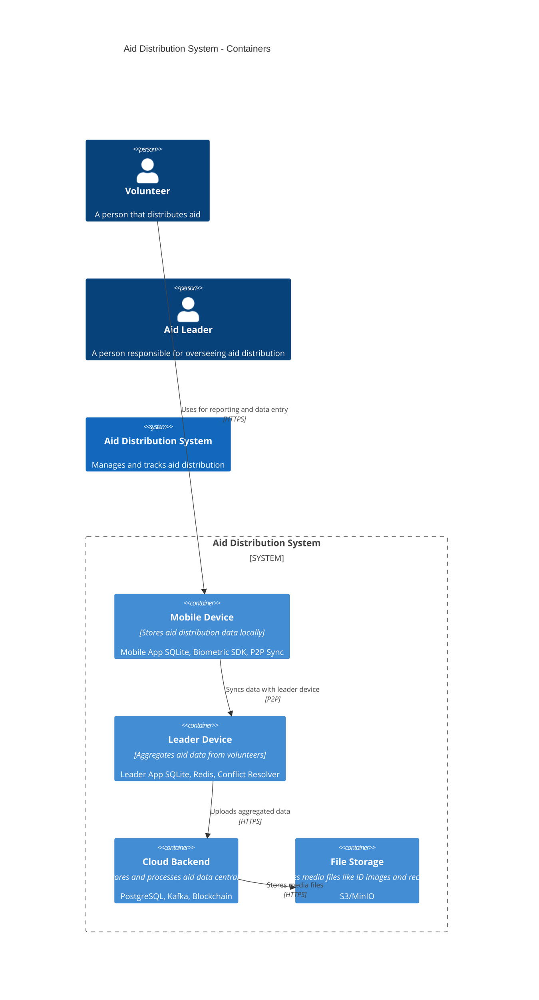

# Aid Distribution System – Data Infrastructure Design

This document outlines the **concrete components**, **technologies**, and **protocols** needed for a resilient and scalable data infrastructure supporting a mobile-based aid distribution system in humanitarian crisis areas.

---

## 1. Clarify Functional and Non-Functional Requirements

### Functional Requirements

- **Register recipients using biometrics or digital IDs.**
- **Distribute and track aid (food, money, medicine).**
- **Allow offline operations and synchronize with leader node.**
- **Recipients can use ID across different programs.**
- **Volunteers use a mobile app to capture and manage data.**

### Non-Functional Requirements

| Requirement   | Description                                                                 |
|---------------|-----------------------------------------------------------------------------|
| **Scalability** | System should support increasing number of users and data entries efficiently. |
| **Availability** | High availability through offline-first architecture and distributed sync. |
| **Consistency** | Eventual consistency across nodes. Local writes with sync conflict resolution. |
| **Latency** | P99 < 200ms for local operations; eventual sync latency within 1-5 minutes. |
| **Security** | Biometric encryption, data-at-rest and data-in-transit security. |
| **Privacy** | User data ownership and encrypted personal records. |
| **Fault Tolerance** | Resilient to device loss; leader election and redundancy built-in. |

---

## 2. Component Services, Databases, and Data Flow

### Component Services

| Component                    | Description                                                      |
|------------------------------|------------------------------------------------------------------|
| **Mobile Node Service**       | Each volunteer’s app that stores local database and handles biometric registration, aid logging, and sync tasks. |
| **Sync & Conflict Resolver**  | Background service that handles conflict resolution and applies CRDT/OT-based merging. |
| **Audit Service**             | Validates and audits aid distribution logs with cryptographic proofs. |
| **Leader Election Module**    | Service to determine the temporary aid group leader if the original is unavailable. |
| **Logging and Monitoring Service** | Tracks actions and health of each node. Logs offline activities. |

### Databases

| Type                    | Description                                                       |
|-------------------------|-------------------------------------------------------------------|
| **Local Mobile DB**      | SQLite/RealmDB, stores biometric IDs, aid logs, and sync queue locally. |
| **Leader DB**            | Acts as coordinator for group-level consistency and synchronization. |
| **Distributed Sync DB**  | Optionally hosted on decentralized or cloud services for remote sync when possible. |

### Data Flow

## 1. Mobile Device (Volunteer Node)

| Component            | Technology / Tool                | Purpose |
|---------------------|----------------------------------|---------|
| Local Database       | SQLite / Realm / PouchDB         | Store recipient records, aid logs locally |
| Biometric SDK        | OpenCV / Neurotechnology / Veridium | Capture and match biometrics (fingerprint/face) |
| Sync Module          | Automerge / Y.js / libp2p        | Enable offline-first syncing and CRDT support |
| Encryption           | AES-GCM / libsodium              | Local data protection |
| Digital ID Handler   | DIDs + Verifiable Credentials    | Decentralized identity system |
| File System Access   | Native OS APIs                   | Caching attachments and receipts |
| Lightweight Server   | HTTP over Wi-Fi Direct/Bluetooth | Local P2P sync between devices |

---

## 2. Leader Device (Aid Supervisor)

| Component            | Technology / Tool                | Purpose |
|---------------------|----------------------------------|---------|
| Aggregator Database  | LiteDB / Redis (AOF) / PostgreSQL | Merge and manage team submissions |
| Conflict Resolver    | Custom CRDT/OT Merge Engine      | Resolve divergent data during sync |
| Sync Dispatcher      | Batched Push Queue + Retry Logic | Send to cloud upon connectivity |
| Key Storage          | OS Keystore / Vault              | Securely store signing keys or JWTs |
| Leader Election      | Raft-style protocol              | Select new leader if current one is lost |
| Admin Interface      | Embedded UI                      | Approve data merges and syncs |

---

## 3. Cloud/National Infrastructure

| Component            | Technology / Tool                | Purpose |
|---------------------|----------------------------------|---------|
| Master Data Store    | PostgreSQL / MongoDB / Cassandra | Scalable central DB with sharding or replication |
| Immutable Ledger     | Hyperledger / Tendermint         | Track distribution events immutably |
| Ingestion Pipeline   | Kafka / Flink / Airflow          | Process and validate incoming data |
| Sync API             | gRPC / REST + mTLS               | Central endpoint for data sync |
| Biometric Indexing   | Neurotechnology MegaMatcher SDK  | Scalable biometric deduplication |
| File/Object Storage  | AWS S3 / MinIO / IPFS            | Store large files and images |
| Monitoring Tools     | Prometheus, Grafana, Sentry, ELK | Observability and issue tracking |

---

## 4. Analytics & Strategic Planning

| Component            | Technology / Tool                | Purpose |
|---------------------|----------------------------------|---------|
| Data Warehouse       | Snowflake / BigQuery / Druid     | Aggregate aid distribution patterns |
| BI Dashboard         | Superset / Metabase / Tableau    | Visual reporting and analytics |
| Audit Dashboard      | Custom dashboard with SQL views  | Track delivery fairness and overlaps |
| ML Engine (Optional) | TensorFlow Lite / ONNX           | On-device anomaly detection or eligibility prediction |

---

## 5. Inter-Node Communication Protocols

| Use Case                        | Technology / Protocol       | Description |
|---------------------------------|-----------------------------|-------------|
| Mobile → Leader Sync            | Automerge CRDT + REST       | Merge data from field device to leader |
| Leader → Cloud Sync             | gRPC / HTTPS + JWT          | Send batch to national infrastructure |
| Offline Peer Sync (Mobile ↔ Mobile) | Wi-Fi Direct + libp2p pubsub | Peer updates without internet |
| Conflict Resolution             | CRDT / OT with version vectors | Resolve merge conflicts |
| Leader Loss Recovery            | Raft / Bully Algorithm      | Elect a new team leader |
| Secure Transfer                 | mTLS + JWT Tokens           | Encrypt and authenticate communications |

---

## 3. Draft API Specification (Sample)

### POST /register
{
  "biometric_hash": "...",
  "name": "",
  "region": "..."
}

### POST /aid/distribute
{
  "recipient_id": "...",
  "type": "food",
  "amount": "..."
}

---

## 4. Tradeoffs and CAP Theorem

| Axis               | Tradeoff                                             |
|--------------------|-----------------------------------------------------|
| **Consistency**     | Relaxed to achieve availability and partition tolerance. |
| **Availability**    | Maximized for offline and disconnected regions.     |
| **Partition Tolerance** | Required due to distributed offline nature.     |

**CAP outcome**: AP system with eventual consistency.

---

## 5. Synchronization & Leader Failover

### Protocols

- **Gossip Protocol** or **Sync Frameworks** (e.g., PouchDB-CouchDB replication).
- **CRDTs** or **OT** for conflict-free merging.

### Leader Failover

- Maintain health-check logs.
- Use mobile consensus (e.g., Bully or Raft variant) to elect a new leader.

---

## 6. Monitoring, Logging, Alerting

- **Local logs**: Activities performed offline.
- **Central aggregation**: When connected.
- **Alert on failures**: No sync > 24h or leader loss.

---

## 7. Testing, Maintenance, and Security

| Aspect         | Notes                                                        |
|----------------|--------------------------------------------------------------|
| **Testing**    | Simulate offline/online transitions, sync conflicts, lost devices. |
| **Security**   | Encrypt biometric and aid records; secure sync endpoints.    |
| **Maintainability** | Versioned sync formats and logs for traceability.      |

---

## 8. Graceful Degradation

- Offline-first behavior.
- Delay sync but queue actions.
- Redundancy through replicated logs.

---

## 9. Architecture
Use sequence diagrams, component diagrams, and C4 modeling:

- **Level 1**: Mobile App + Offline DB
- **Level 2**: Services inside mobile node
- **Level 3**: Sync & Leader coordination flow

## 10. Data infrastructure

## 11. C4 models

